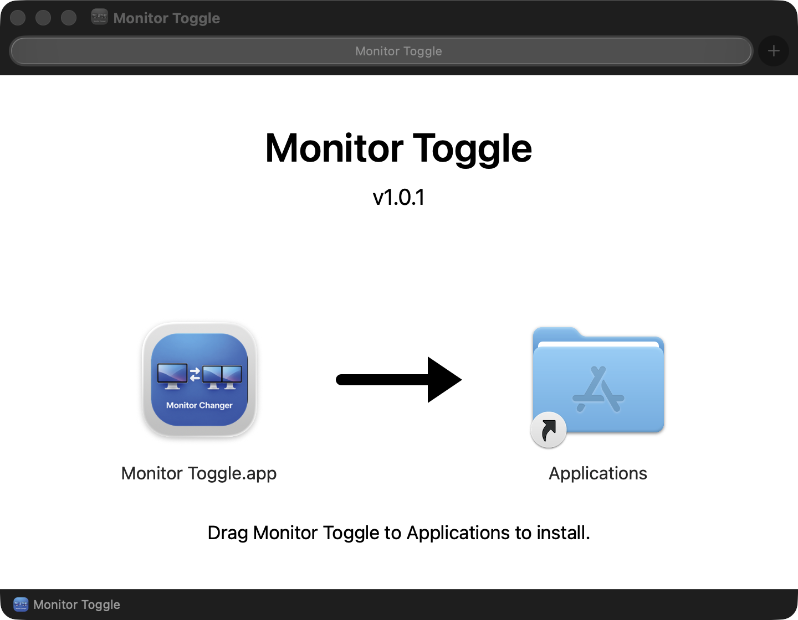

# Monitor Toggle for macOS

macOS 메뉴 바에서 싱글/듀얼 모니터 배치를 전환하는 앱입니다.

**[최신 버전 다운로드 — MonitorToggle.dmg](https://github.com/brainok/Monitor-single-dual-changer-mac-release/releases/latest/download/MonitorToggle.dmg)**

[전체 릴리스](https://github.com/brainok/Monitor-single-dual-changer-mac-release/releases) · [소스 저장소](https://github.com/brainok/Monitor-single-dual-changer)

## 설치

1. macOS 14 이상, Apple Silicon Mac에서 사용하세요.
2. Homebrew로 화면 전환 도구를 설치하세요: `brew install jakehilborn/jakehilborn/displayplacer`.
3. DMG를 열고 **Monitor Toggle**을 **Applications** 폴더로 드래그하세요.
4. 응용 프로그램에서 실행하면 화면 상단 메뉴 바에 모니터 아이콘이 나타납니다.

앱과 DMG는 Developer ID로 서명하고 Apple 공증을 받았습니다. 다운로드에 로그인이나 결제는 필요하지 않습니다.

About에서 Git 태그 버전과 라이선스 입력 화면을 확인할 수 있습니다. 스토어 발급 코드는 처음 활성화할 때 인터넷이 필요하며, 성공 후에는 앱 전용 Keychain에 저장된 활성화를 오프라인으로 사용합니다. 지정된 공용 호환 코드는 로컬에서 검증합니다.

## 문의

Made by Hyo Suk Nam

[brainok777@gmail.com](mailto:brainok777@gmail.com) · [Brainok Store](https://store.brainok.net)

DMG는 GitHub Release 첨부 파일로 배포하며, 버전별 릴리스 정보와 체크섬은 이 저장소에 기록합니다.

## 설치 화면

